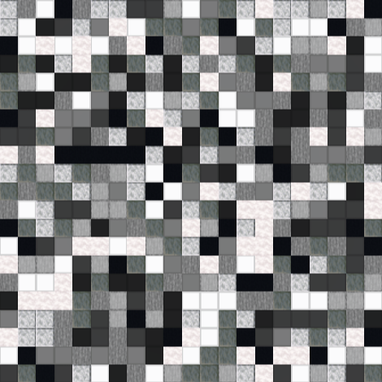
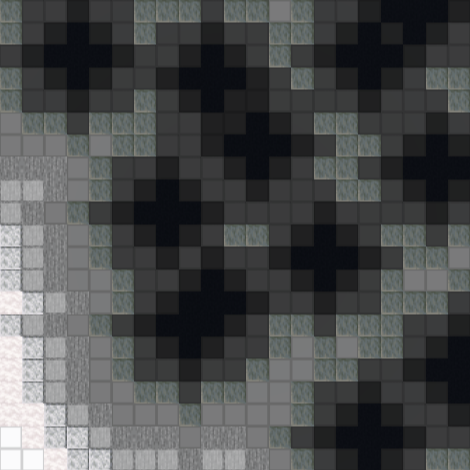
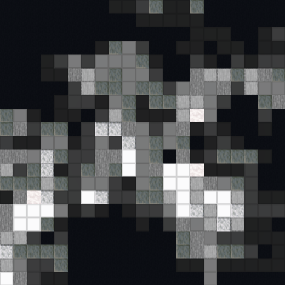
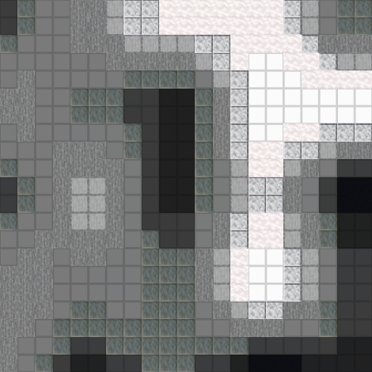

# Noise Algorithms Datapack  
text.  

## Random Noise Algorithm  
  
**Logic**
```python
import random

# generate 21x21 grid
grid = [[0 for x in range(21)] for y in range(21)]

# assign random values
foreach y in range(21):
    foreach x in range(21):
        grid[y][x] = random.randint(1, 10)
```

**Commands**
```mcfunction
# assign random values
execute as @e[tag=dummy] store result score @s random10 run scoreboard players get @e[tag=r10,limit=1,sort=random] random10
```

## Voronoi Noise Algorithm  
  

## Random Walker Algorithm  
  

## Custom Lerp Algoritm  
  

# General commands
**Get random values**
```mcfunction
# you will need this scoreboard:
scoreboard objectives add random10 dummy

# summon armor 10 stands with random values 1 through 10:
summon armor_stand 0 0 0 {Tags:["r10"],Invisible:1}
scoreboard players add @e[tag=r10] random10 1
summon armor_stand 0 0 0 {Tags:["r10"],Invisible:1}
scoreboard players add @e[tag=r10] random10 1
summon armor_stand 0 0 0 {Tags:["r10"],Invisible:1}
scoreboard players add @e[tag=r10] random10 1
summon armor_stand 0 0 0 {Tags:["r10"],Invisible:1}
scoreboard players add @e[tag=r10] random10 1
summon armor_stand 0 0 0 {Tags:["r10"],Invisible:1}
scoreboard players add @e[tag=r10] random10 1
summon armor_stand 0 0 0 {Tags:["r10"],Invisible:1}
scoreboard players add @e[tag=r10] random10 1
summon armor_stand 0 0 0 {Tags:["r10"],Invisible:1}
scoreboard players add @e[tag=r10] random10 1
summon armor_stand 0 0 0 {Tags:["r10"],Invisible:1}
scoreboard players add @e[tag=r10] random10 1
summon armor_stand 0 0 0 {Tags:["r10"],Invisible:1}
scoreboard players add @e[tag=r10] random10 1
summon armor_stand 0 0 0 {Tags:["r10"],Invisible:1}
scoreboard players add @e[tag=r10] random10 1
```

**Render blocks grayscale**
```mcfunction
execute at @e[scores={random10=1}] run setblock ~ ~ ~ black_concrete
execute at @e[scores={random10=2}] run setblock ~ ~ ~ black_wool
execute at @e[scores={random10=3}] run setblock ~ ~ ~ gray_wool
execute at @e[scores={random10=4}] run setblock ~ ~ ~ polished_tuff
execute at @e[scores={random10=5}] run setblock ~ ~ ~ light_gray_wool
execute at @e[scores={random10=6}] run setblock ~ ~ ~ stone
execute at @e[scores={random10=7}] run setblock ~ ~ ~ smooth_stone
execute at @e[scores={random10=8}] run setblock ~ ~ ~ polished_diorite
execute at @e[scores={random10=9}] run setblock ~ ~ ~ stripped_pale_oak_wood
execute at @e[scores={random10=10}] run setblock ~ ~ ~ white_wool
```

**Round scaled numbers**
```mcfunction
scoreboard players set @s[scores={random10=11..149}] random10 1
scoreboard players set @s[scores={random10=150..249}] random10 2
scoreboard players set @s[scores={random10=250..349}] random10 3
scoreboard players set @s[scores={random10=350..449}] random10 4
scoreboard players set @s[scores={random10=450..549}] random10 5
scoreboard players set @s[scores={random10=550..649}] random10 6
scoreboard players set @s[scores={random10=650..749}] random10 7
scoreboard players set @s[scores={random10=750..849}] random10 8
scoreboard players set @s[scores={random10=850..949}] random10 9
scoreboard players set @s[scores={random10=950..1000}] random10 10
```

**Get distance to control point**
```mcfunction
execute at @s if entity @e[tag=control,distance=9..] run scoreboard players set @s random10 10
execute at @s if entity @e[tag=control,distance=8..9] run scoreboard players set @s random10 9
execute at @s if entity @e[tag=control,distance=7..8] run scoreboard players set @s random10 8
execute at @s if entity @e[tag=control,distance=6..7] run scoreboard players set @s random10 7
execute at @s if entity @e[tag=control,distance=5..6] run scoreboard players set @s random10 6
execute at @s if entity @e[tag=control,distance=4..5] run scoreboard players set @s random10 5
execute at @s if entity @e[tag=control,distance=3..4] run scoreboard players set @s random10 4
execute at @s if entity @e[tag=control,distance=2..3] run scoreboard players set @s random10 3
execute at @s if entity @e[tag=control,distance=1..2] run scoreboard players set @s random10 2
execute at @s if entity @e[tag=control,distance=0..1] run scoreboard players set @s random10 1
```